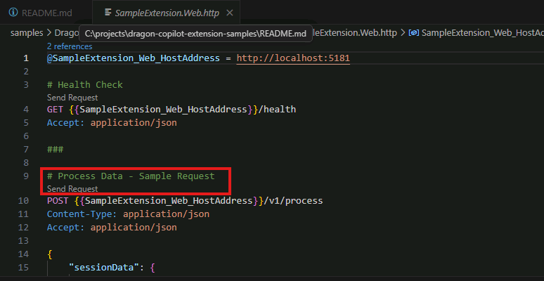

## Getting Started

First, we'll be building the [sample application](https://github.com/microsoft/dragon-copilot-extension-samples) and issuing a call from VS Code to simulate an invocation from Dragon Copilot.

The sample code has been pre-loaded onto the machine at the location c:\projects\dragon-copilot-extension-samples

### Start the solution
1. Open VS Code. The folder should already be opened for you.
    1. If not, select File -> Open Folder -> +++c:\projects\dragon-copilot-extension-samples+++
2. Select Terminal -> New Terminal
3. Inside the terminal window, change the working directory -> +++cd samples\DragonCopilot\Workflow\SampleExtension.Web+++
4. Issue a +++git pull+++ command to obtain the latest version of the sample.
4. Issue a +++dotnet run+++ command.

The application should now be running and available at https://localhost:5181

### Test the service
1. Open the http file `samples\DragonCopilot\Workflow\SampleExtension.Web\SampleExtension.Web.http`
1. Click the second `Send Request` present in the file.

    
1. Verify that your output is similar to the following and then stop the application. 
    ```http
    HTTP/1.1 200 OK
    Connection: close
    Content-Type: application/json; charset=utf-8
    Date: Mon, 06 Oct 2025 13:20:44 GMT
    Server: Kestrel
    Transfer-Encoding: chunked

    {
      "success": true,
      "message": "Payload processed successfully",
      "payload": {
        "sample-entities": {
          "schema_version": "0.1",
          "document": {
            "title": "Outpatient Note",
            "type": {
              "text": "string"
            }
          },
          "resources": []
        },
        "adaptive-card": {
            // abbreviated
        }
      }
    }
	```

This demonstrates that the sample application is correctly working.
