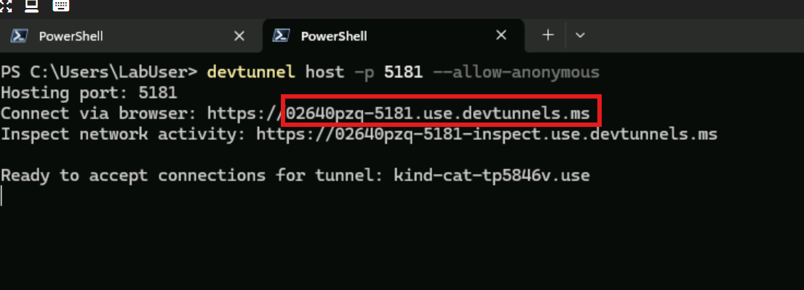

## Using DevTunnels

1. Open a new terminal windows
2. Issue a `devtunnel login` command.
    1. Select "Work or School Account"
    2. Your login credentials can be found in the resources tab above the instructions.
3. Issue a `devtunnel host -p 5181 --allow-anonymous` command
4. Copy the URL that is output in the terminal. Make sure to copy the dev tunnel "connect via browser url" as shown in example below.

    

5. Past your devtunnel domain as copied above into the following textbox for later use in the lab. Be sure to **not** include the scheme (e.g. "https://"):

 @lab.TextBox(devtunnelDomain)

Your locally running endpoint is now accessible via a hosted DevTunnel to the internet.
