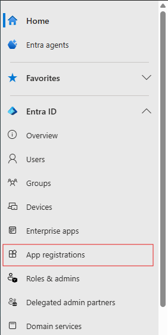
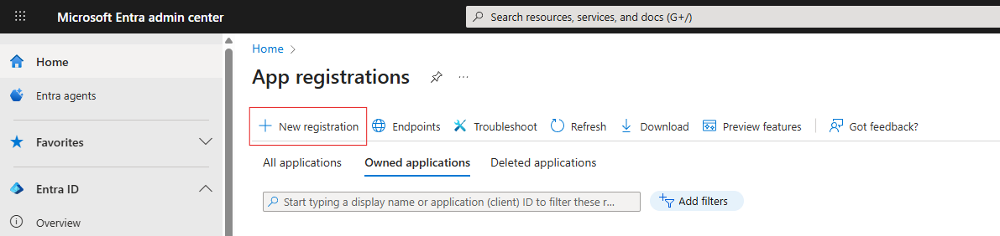
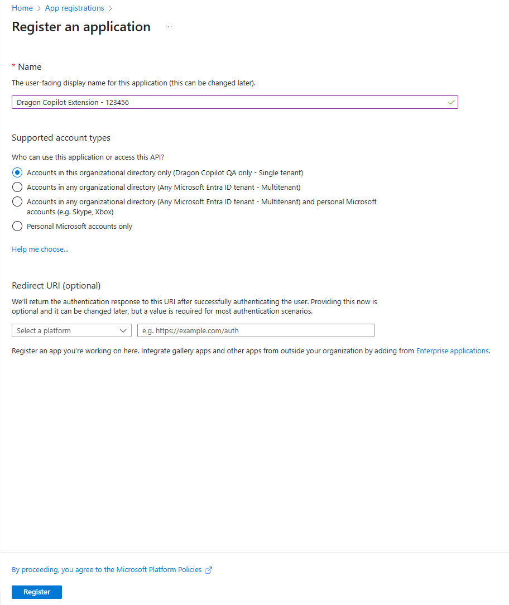
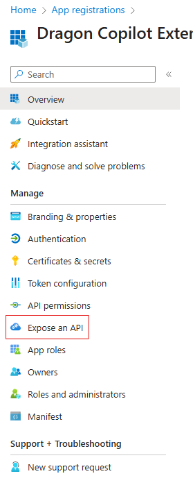
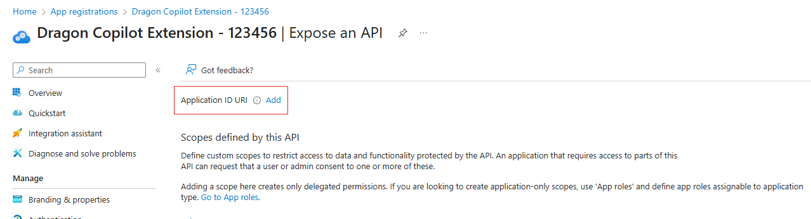
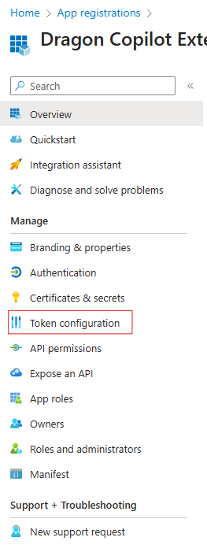
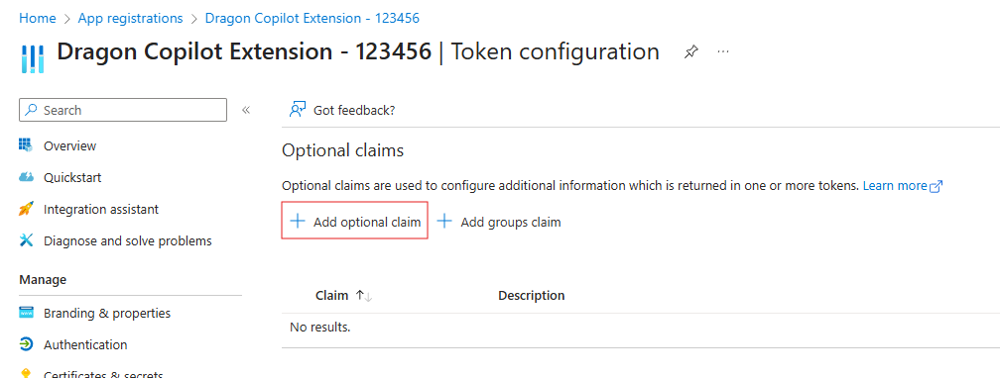
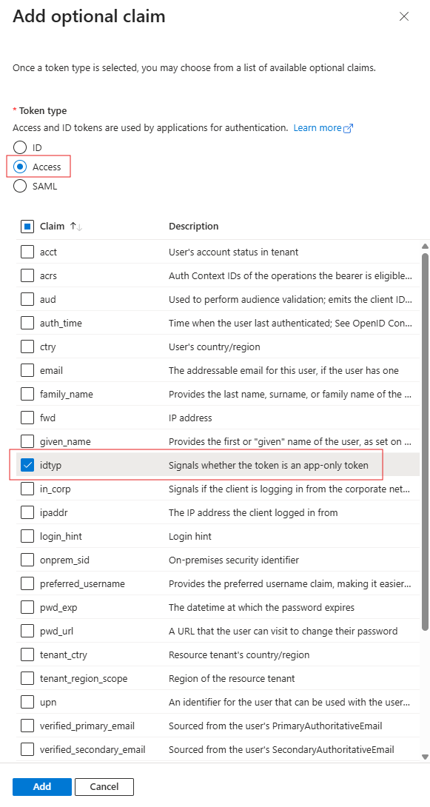
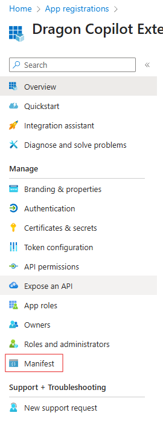
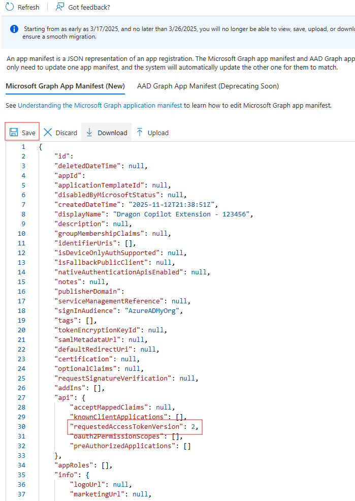

## Creating an Entra Application

Create Entra application

1. Open the browser and go to `https://entra.microsoft.com`
3. In the Entra portal, select "App registrations" from the left menu.

    
4. From the top menu select "New Registration"

    
5. In the "Name" field input +++Dragon Copilot Extension - @lab.LabInstance.Id+++

    
6. Click "Register"
7. In the Application details navigation, select "Expose an API"

    
8. Beside the "Application ID URI" select "Add"

    
9. In the "Application ID URI" textbox, use the follwoing value `api://@lab.CloudSubscription.TenantId/@lab.Variable(devtunnelDomain)`
10. Click the "Save" button
11. In the application details navigation, select "Token Configuration"

    
12. Select "Add Optional Claim" in the details section

    
13. For token type select "Access" and in the list of claims select "idtyp"

    
15. Click the "Add" button
16. In the application details navigation, select "Manifest"

    
17. Find the property "requestedAccessTokenVersion" and change the value from `null` to `2`

    
18. Click the "Save" button

You have now setup the application needed for Dragon Copilot to create a token to call your service.
