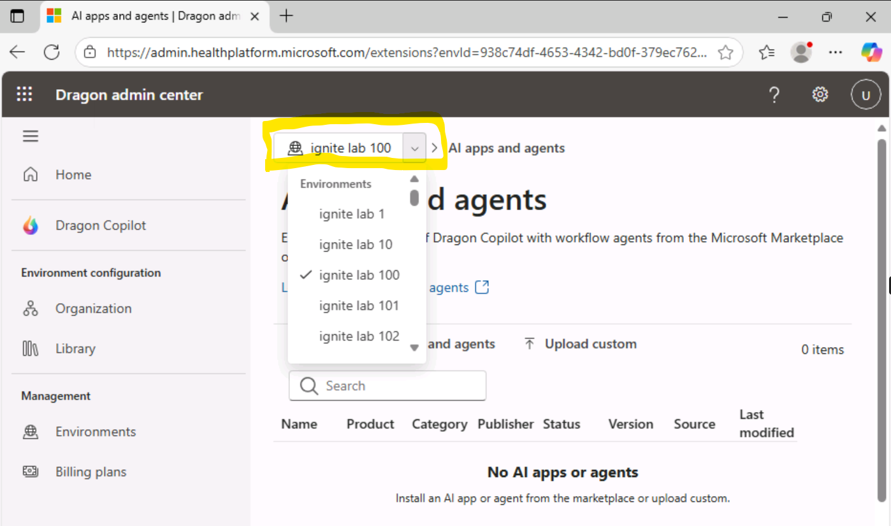
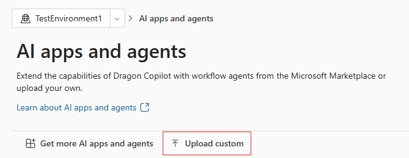
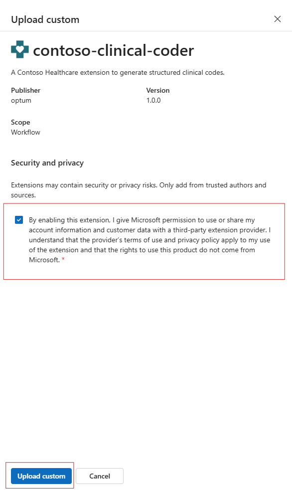

## Installing your Extension

1. Open the browser and go to `https://admin.healthplatform.microsoft.com/extensions`
2. Click the dropdown at the top

    
3. In the page navigation click "Upload custom"

    
4. Select the previously created zip file
5. Agree to the terms

    
6. Click the "Upload custom" button
