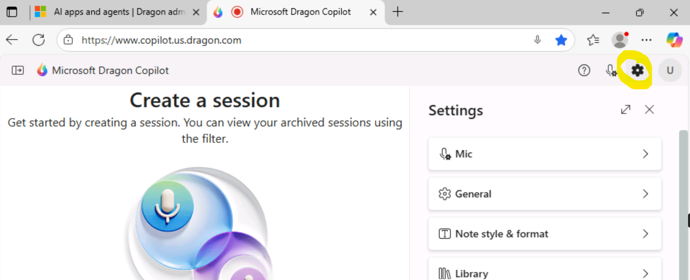
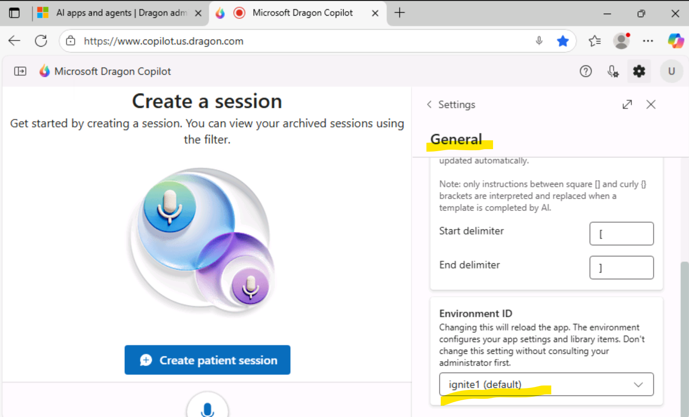
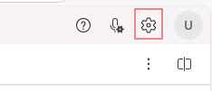
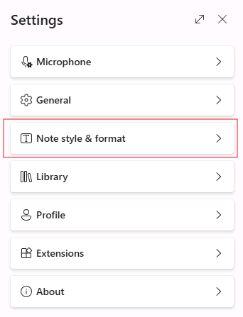
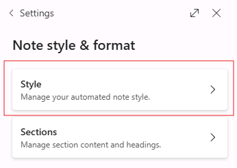
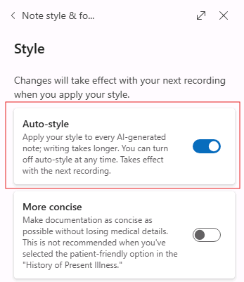
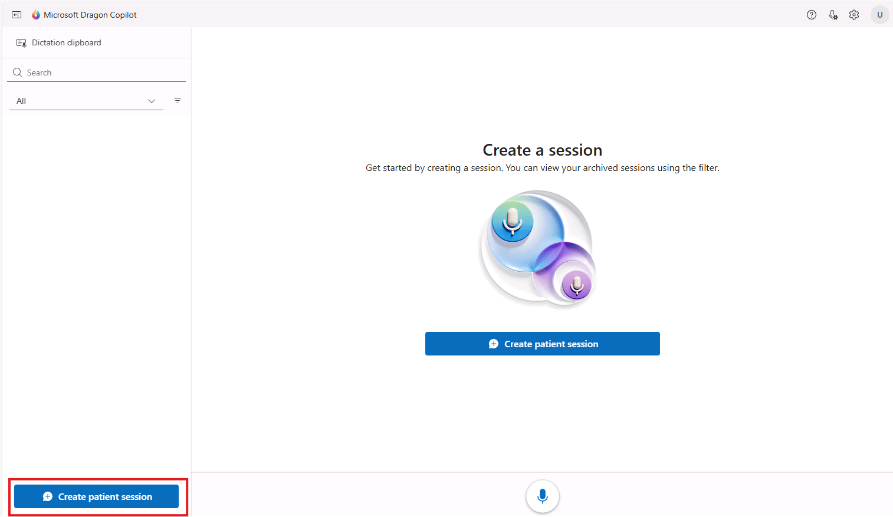
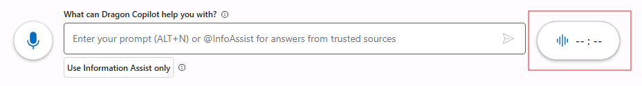
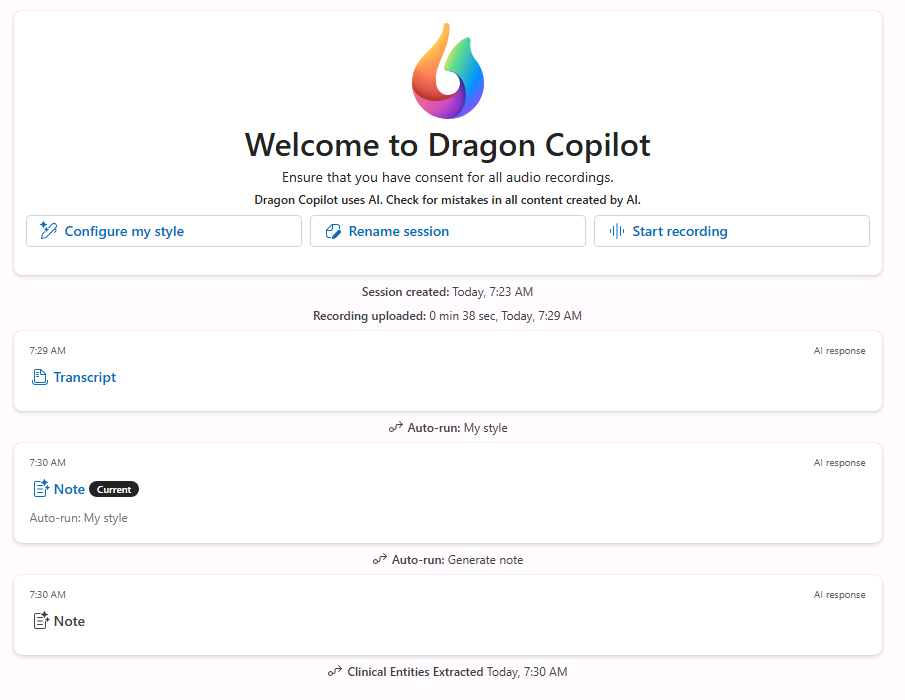
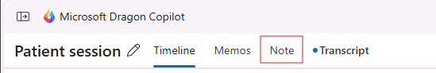

## Testing your Extension

1. Open the browser and go to `https://www.copilot.us.dragon.com`
2. Click "Sign In"
3. Allow the use of the microphone in the popup in the top left.
4. Go through the initial setup
    1. Select any Primary speciality
    2. Click "Next"
    3. Slect any role
    4. Click "Next"
    5. Click "Complete setup"
5. Switch environment using following steps:
    1. Click "Settings"
    
    2. Click "General"
    3. Select your assigned environment from the dropdown
    
    4. Click "Reload app" in Change Environment popup
    
    5. Go through step 4 i.e. initial setup of selecting specialties.

6. Ensure "Auto-style" is enabled
    1. Click the gear icon in the top right
    
       
    3. Click "Note style & format" in the menu
    
    	
    5. Click "Style" in the menu
    
    	
    7. Toggle "Auto-style" to enabled
    
    	 
    9. This setting is auto-saved and only needs to happen once
6. Ensure other extensions disabled
    1. Click the gear icon in the top right
    
       
    2. Click "Extensions" in the menu
    3. Select extensions besides your own
    4. Toggle the extension off
    5. This setting is auto-saved and only needs to happen once
7. Click "Create patient session" in the bottom left
    
8. Create an ambient recording by clicking the button to the right of the prompt box in the bottom.
    
9. Sample script:

  > Mr. John Doe is a 55-year-old male here for follow-up on hypertension. He's taking lisinopril 20 milligrams daily with good adherence. Blood pressure today is 128 over 78, heart  rate 72. He reports no chest pain, shortness of breath, or headaches. He does note occasional mild dizziness when standing quickly, otherwise feels well. Exam is unremarkable, lungs are clear, heart regular, no edema.
  > 
  > Assessment: Hypertension, well controlled. Mild orthostatic dizziness likely related to medication but not impacting daily function.
  >
  > Plan: Continue current lisinopril dose. Encourage hydration and slower positional changes. Reinforced diet and exercise recommendations. Ordered labs for next visit. Follow up in six months or sooner if symptoms worsen.

7. Click the same button to stop recording.

8. After recording is complete you should see a number of things happen:
    * Recording uploaded
    * Note generated
    * Auto-style executed
    * Extension executed and displayed in the Note section.
 	

9. Click the "Note" tab and scroll to the bottom to see your results
	
